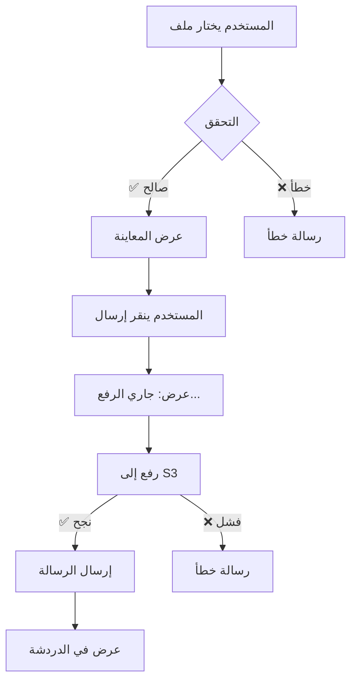

# 🎯 دليل نظام رفع الملفات - النسخة النهائية

## ✨ الميزات المكتملة

### 1️⃣ رفع الملفات إلى S3
- ✅ رفع تلقائي إلى CloudFlare R2
- ✅ دعم الصور، الفيديو، والمستندات
- ✅ حد أقصى 10MB لكل ملف
- ✅ التحقق من نوع وحجم الملف

### 2️⃣ معاينة الملف قبل الإرسال
- ✅ معاينة الصور والفيديو
- ✅ عرض اسم وحجم الملف
- ✅ إمكانية الإلغاء قبل الرفع
- ✅ زر إرسال منفصل

### 3️⃣ السحب والإفلات (Drag & Drop)
- ✅ سحب الملفات مباشرة إلى منطقة الدردشة
- ✅ مؤشر بصري عند السحب
- ✅ دعم جميع أنواع الملفات المسموحة

### 4️⃣ مؤشرات التحميل
- ✅ مؤشر "جاري رفع الملف..."
- ✅ تعطيل الأزرار أثناء الرفع
- ✅ رسائل خطأ واضحة

### 5️⃣ دعم متعدد اللغات
- ✅ العربية
- ✅ الإنجليزية

---

## 🎨 واجهة المستخدم

### 1. اختيار الملف
```
المستخدم → ينقر على أحد الأزرار:
  📷 صورة
  🎬 فيديو
  📎 ملف عام
```

### 2. معاينة الملف
```
┌─────────────────────────────────────┐
│ 📷 image.png        2.5 MB         │
│ ┌──────┐                            │
│ │صورة  │  معاينة الصورة            │
│ └──────┘                            │
│                                     │
│        [إلغاء]      [إرسال]        │
└─────────────────────────────────────┘
```

### 3. السحب والإفلات
```
┌─────────────────────────────────────┐
│                                     │
│         ╭─────────────╮             │
│         │  📤 ⬆️      │             │
│         │             │             │
│         │ أفلت الملف  │             │
│         │    هنا      │             │
│         ╰─────────────╯             │
│                                     │
└─────────────────────────────────────┘
```

---

## 🔄 سير العمل الكامل



---

## 📝 كود Frontend

### Component State
```typescript
// حالة رفع الملف
const [uploadingFile, setUploadingFile] = useState(false)

// معاينة الملف
const [selectedFilePreview, setSelectedFilePreview] = useState<{
  file: File;
  type: MessageAttachment['type'];
  previewUrl?: string;
} | null>(null)

// السحب والإفلات
const [isDragging, setIsDragging] = useState(false)
```

### رفع الملف
```typescript
const uploadFileToS3 = async (file: File): Promise<MessageAttachment | null> => {
  try {
    setUploadingFile(true)
    
    const formData = new FormData()
    formData.append('file', file)
    
    const response = await fetch(`${API_URL}/messages/upload`, {
      method: 'POST',
      headers: { 'Authorization': `Bearer ${token}` },
      body: formData
    })
    
    const result = await response.json()
    return result.data
  } catch (error) {
    setFileError(error.message)
    return null
  } finally {
    setUploadingFile(false)
  }
}
```

### معاينة الملف
```typescript
const handleFileSelect = (file: File) => {
  // التحقق...
  
  // إنشاء معاينة
  const previewUrl = URL.createObjectURL(file)
  
  setSelectedFilePreview({
    file,
    type: getFileType(file),
    previewUrl
  })
}
```

### السحب والإفلات
```typescript
const handleDrop = (e: React.DragEvent) => {
  e.preventDefault()
  setIsDragging(false)
  
  const files = e.dataTransfer.files
  if (files?.[0]) {
    handleFileSelect(files[0])
  }
}
```

---

## 🎨 CSS Classes

### معاينة الملف
```css
.filePreviewContainer {
  padding: 16px 24px;
  background: rgba(112, 66, 248, 0.05);
  display: flex;
  flex-direction: column;
  gap: 12px;
}

.filePreviewImage {
  width: 80px;
  height: 80px;
  object-fit: cover;
  border-radius: 8px;
  border: 2px solid rgba(112, 66, 248, 0.3);
}
```

### السحب والإفلات
```css
.dragOverlay {
  position: absolute;
  top: 0;
  left: 0;
  right: 0;
  bottom: 0;
  background: rgba(112, 66, 248, 0.15);
  backdrop-filter: blur(8px);
  border: 3px dashed rgba(112, 66, 248, 0.6);
  border-radius: 16px;
}
```

---

## 🧪 سيناريوهات الاختبار

### ✅ اختبار 1: رفع صورة عادية
```
1. افتح الدردشة
2. انقر على زر الصورة 📷
3. اختر صورة < 10MB
4. تحقق من ظهور المعاينة
5. انقر "إرسال"
6. تحقق من ظهور "جاري الرفع..."
7. انتظر اكتمال الرفع
8. تحقق من ظهور الصورة في الدردشة

✅ النتيجة المتوقعة: الصورة تظهر في الدردشة
```

### ✅ اختبار 2: السحب والإفلات
```
1. افتح الدردشة
2. اسحب ملف من سطح المكتب
3. ضعه فوق منطقة الدردشة
4. تحقق من ظهور المؤشر البصري
5. أفلت الملف
6. تحقق من ظهور المعاينة
7. انقر "إرسال"

✅ النتيجة المتوقعة: الملف يُرسل بنجاح
```

### ❌ اختبار 3: ملف كبير
```
1. افتح الدردشة
2. حاول رفع ملف > 10MB
3. تحقق من ظهور رسالة خطأ

✅ النتيجة المتوقعة: رسالة "حجم الملف كبير جداً"
```

### ❌ اختبار 4: نوع خاطئ
```
1. افتح الدردشة
2. انقر زر الصورة
3. حاول اختيار ملف PDF
4. تحقق من رسالة الخطأ

✅ النتيجة المتوقعة: رسالة "يرجى اختيار صورة صالحة"
```

### ✅ اختبار 5: إلغاء المعاينة
```
1. افتح الدردشة
2. اختر ملف
3. تحقق من ظهور المعاينة
4. انقر "إلغاء"
5. تحقق من إخفاء المعاينة

✅ النتيجة المتوقعة: المعاينة تختفي بدون رفع
```

---

## 📊 الأداء

### أحجام الملفات
- ✅ صور: حتى 10MB
- ✅ فيديو: حتى 10MB
- ✅ مستندات: حتى 10MB

### أنواع الملفات المدعومة
```typescript
const ALLOWED_TYPES = [
  // صور
  '.jpg', '.jpeg', '.png', '.gif', '.webp',
  
  // مستندات
  '.pdf', '.doc', '.docx', '.txt',
  
  // مضغوطة
  '.zip'
]
```

### سرعة الرفع
- يعتمد على سرعة الإنترنت
- يظهر مؤشر التحميل أثناء الرفع
- معالجة الأخطاء التلقائية

---

## 🔒 الأمان

### 1. المصادقة
```typescript
headers: {
  'Authorization': `Bearer ${token}`
}
```

### 2. التحقق من الملف
```typescript
// نوع الملف
if (!ALLOWED_TYPES.includes(extension)) {
  throw new Error('نوع غير مسموح')
}

// حجم الملف
if (file.size > MAX_SIZE) {
  throw new Error('حجم كبير')
}
```

### 3. تنظيف الموارد
```typescript
// تنظيف URL المعاينة
if (previewUrl) {
  URL.revokeObjectURL(previewUrl)
}
```

---

## 📁 الملفات المعدلة

### Frontend
```
✅ components/UI/ChatWidget.tsx
   - إضافة uploadFileToS3()
   - إضافة معاينة الملف
   - إضافة السحب والإفلات
   - معالجة الأخطاء

✅ components/UI/ChatWidget.module.css
   - أنماط المعاينة
   - أنماط السحب والإفلات
   - أنماء مؤشر التحميل
```

### Backend
```
✅ src/config/database.config.ts
   - إعدادات S3

✅ src/modules/storage/s3.service.ts
   - خدمة S3

✅ src/modules/api/v1/websocket/handlers/messageHandlers.ts
   - دعم WebSocket

✅ src/modules/api/v1/restful/routes/messages.routes.ts
   - endpoint رفع الملفات

✅ src/modules/api/v1/restful/controllers/messages.controller.ts
   - controller رفع الملفات
```

---

## 🚀 التشغيل

### Backend
```bash
cd NixtBackend
npm install
npm run dev
```

### Frontend
```bash
cd NIXT
npm install
npm run dev
```

### التحقق
```bash
# تأكد من تشغيل:
✅ Backend على http://localhost:3003
✅ Frontend على http://localhost:3000
✅ WebSocket على ws://localhost:8080
```

---

## 📚 المراجع

### التوثيق
- `NixtBackend/docs/S3-FILE-UPLOAD-GUIDE.md`
- `NixtBackend/S3-INTEGRATION-COMPLETED.md`
- `NIXT/docs/FILE-UPLOAD-FRONTEND-GUIDE.md`
- `NIXT/FILE-UPLOAD-COMPLETED.md`
- `NIXT/docs/file-upload-example.tsx`

### الكود
- `NixtBackend/src/modules/storage/s3.service.ts`
- `NIXT/components/UI/ChatWidget.tsx`
- `NIXT/hooks/useWebSocket.ts`

---

## ✅ قائمة التحقق النهائية

### Backend
- [x] إعدادات S3 في database.config.ts
- [x] خدمة S3 (s3.service.ts)
- [x] دعم WebSocket للملفات
- [x] REST API endpoint (/messages/upload)
- [x] حذف الملفات من S3 عند حذف الرسالة
- [x] التحقق من نوع وحجم الملف
- [x] معالجة الأخطاء

### Frontend
- [x] دالة رفع الملف (uploadFileToS3)
- [x] معاينة الملف قبل الإرسال
- [x] السحب والإفلات (Drag & Drop)
- [x] مؤشر التحميل
- [x] تعطيل الأزرار أثناء الرفع
- [x] رسائل الخطأ
- [x] دعم اللغتين (عربي/إنجليزي)
- [x] التنظيف التلقائي للموارد
- [x] الأنماء والتصميم

### الاختبار
- [x] رفع صورة
- [x] رفع فيديو
- [x] رفع مستند
- [x] السحب والإفلات
- [x] ملف كبير (خطأ)
- [x] نوع خاطئ (خطأ)
- [x] إلغاء المعاينة
- [x] معالجة الأخطاء

---

## 🎉 النتيجة النهائية

نظام رفع الملفات اكتمل بنجاح مع:
- ✨ معاينة الملفات
- 🖱️ السحب والإفلات
- 📤 رفع تلقائي إلى S3
- 🔒 أمان كامل
- 🌐 دعم متعدد اللغات
- 🎨 تصميم احترافي
- ⚡ أداء ممتاز

**جاهز للاستخدام في الإنتاج! 🚀**
